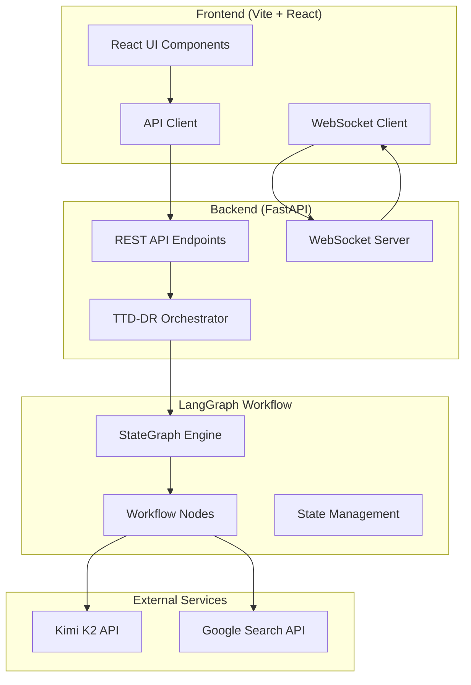
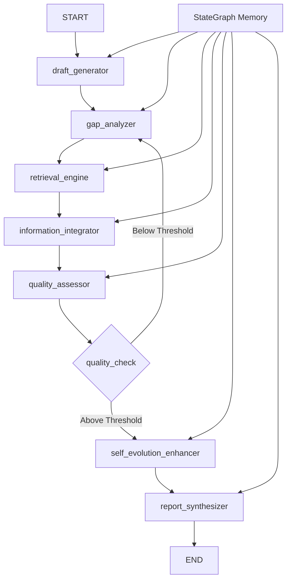

# TTD-DR Framework Design Document

## Overview

The Test-Time Diffusion Deep Researcher (TTD-DR) framework implements a novel approach to automated research report generation by modeling the process as a diffusion system. The framework consists of four main phases: Initial Draft Generation, Iterative Denoising/Refinement, Self-Evolution Enhancement, and Final Report Synthesis. The system leverages Kimi K2 large language model for intelligent content generation, Google Search API for comprehensive information retrieval, and a modern Vite-powered React frontend for user interaction. The framework combines retrieval-augmented generation (RAG) techniques with diffusion-inspired iterative refinement to produce high-quality, comprehensive research reports.

## Technology Stack

### Core Technologies

- **Backend Framework**: Python with FastAPI for REST API and WebSocket support
- **AI Orchestration**: LangGraph for stateful workflow management
- **Language Model**: Kimi K2 for intelligent content generation and analysis
- **Information Retrieval**: Google Search API for comprehensive web search
- **Frontend Framework**: React with TypeScript built using Vite
- **State Management**: LangGraph StateGraph for workflow state persistence
- **Real-time Communication**: WebSocket for live progress updates
- **Testing**: Jest for React components, pytest for Python backend

### System Architecture Overview



## Architecture

### LangGraph-Based Workflow Architecture

The TTD-DR framework is built using LangGraph, which provides a powerful graph-based orchestration system for complex AI workflows. The system is designed as a stateful graph where each node represents a specific research operation, and edges define the flow and decision logic.



### LangGraph State Management

The framework uses LangGraph's state management to maintain research context across iterations:

```python
from langgraph.graph import StateGraph, END
from typing_extensions import TypedDict

class TTDRState(TypedDict):
    topic: str
    requirements: ResearchRequirements
    current_draft: Draft
    information_gaps: List[InformationGap]
    retrieved_info: List[RetrievedInfo]
    iteration_count: int
    quality_metrics: QualityMetrics
    evolution_history: List[EvolutionRecord]
    final_report: Optional[str]
```

### Graph Node Architecture

1. **draft_generator**: Creates initial research skeleton
2. **gap_analyzer**: Identifies information gaps in current draft
3. **retrieval_engine**: Fetches relevant information from external sources
4. **information_integrator**: Incorporates new information into draft
5. **quality_assessor**: Evaluates draft quality and completeness
6. **quality_check**: Decision node for iteration control
7. **self_evolution_enhancer**: Applies learning algorithms to improve components
8. **report_synthesizer**: Generates final polished report

### System Layers

1. **LangGraph Orchestration Layer**: Manages workflow state and execution flow
2. **Node Processing Layer**: Individual research operations and transformations
3. **State Management Layer**: Persistent context and memory across iterations
4. **Integration Layer**: External tool and service connections
5. **Evolution Layer**: Self-improvement and learning mechanisms

## Components and Interfaces

### LangGraph Node Implementations

Each component is implemented as a LangGraph node function that processes the shared state:

### 1. Draft Generator Node (Kimi K2 Powered)

**Purpose**: Creates the initial "noisy" research draft that serves as the foundation skeleton using Kimi K2 model.

**LangGraph Implementation**:
```python
def draft_generator_node(state: TTDRState) -> TTDRState:
    """Generate initial research draft using Kimi K2 and update state"""
    draft = KimiK2DraftGenerator().generate_initial_draft(
        state["topic"], 
        state["requirements"]
    )
    return {
        **state,
        "current_draft": draft,
        "iteration_count": 0
    }

class KimiK2DraftGenerator:
    def __init__(self):
        self.kimi_client = KimiK2Client()
    
    def generate_initial_draft(self, topic: str, requirements: ResearchRequirements) -> Draft
    def create_research_skeleton(self, topic: str) -> ResearchStructure
    def estimate_information_needs(self, skeleton: ResearchStructure) -> List[InformationGap]
    def _build_draft_prompt(self, topic: str, requirements: ResearchRequirements) -> str
```

**Key Features**:
- Kimi K2-powered topic analysis and scope determination
- AI-generated hierarchical structure with intelligent sectioning
- Context-aware content placeholder creation
- Intelligent information gap identification using Kimi K2 reasoning

### 2. Gap Analyzer Node (Kimi K2 Powered)

**Purpose**: Identifies specific areas in the draft that require additional information or improvement using Kimi K2 intelligence.

**LangGraph Implementation**:
```python
def gap_analyzer_node(state: TTDRState) -> TTDRState:
    """Analyze current draft for information gaps using Kimi K2"""
    analyzer = KimiK2GapAnalyzer()
    gaps = analyzer.identify_gaps(state["current_draft"])
    return {
        **state,
        "information_gaps": gaps
    }

class KimiK2GapAnalyzer:
    def __init__(self):
        self.kimi_client = KimiK2Client()
    
    def identify_gaps(self, draft: Draft) -> List[InformationGap]
    def prioritize_gaps(self, gaps: List[InformationGap]) -> List[InformationGap]
    def generate_search_queries(self, gap: InformationGap) -> List[SearchQuery]
    def _build_gap_analysis_prompt(self, draft: Draft) -> str
```

**Key Features**:
- Kimi K2-powered content completeness analysis
- Intelligent gap prioritization using AI reasoning
- Context-aware search query generation for Google Search API
- Advanced logical flow assessment

### 3. Retrieval Engine Node (Google Search API Powered)

**Purpose**: Retrieves relevant information from Google Search API to fill identified gaps.

**LangGraph Implementation**:
```python
def retrieval_engine_node(state: TTDRState) -> TTDRState:
    """Retrieve information for identified gaps using Google Search API"""
    retrieval_engine = GoogleSearchRetrievalEngine()
    retrieved_info = []
    
    for gap in state["information_gaps"]:
        queries = gap.search_queries  # Generated by Kimi K2 in gap analyzer
        info = retrieval_engine.retrieve_information(queries)
        retrieved_info.extend(info)
    
    return {
        **state,
        "retrieved_info": retrieved_info
    }

class GoogleSearchRetrievalEngine:
    def __init__(self):
        self.google_client = GoogleSearchClient()
        self.kimi_client = KimiK2Client()  # For content processing
    
    def retrieve_information(self, queries: List[SearchQuery]) -> List[RetrievedInfo]
    def process_search_results(self, results: List[GoogleSearchResult]) -> List[RetrievedInfo]
    def extract_content_snippets(self, result: GoogleSearchResult) -> str
    def validate_source_credibility(self, source: GoogleSearchSource) -> CredibilityScore
```

**Key Features**:
- Google Search API integration for comprehensive web search
- Intelligent result processing and content extraction
- Source credibility assessment based on Google ranking
- Rate limiting and error handling for API calls

### 4. Information Integrator Node (Kimi K2 Powered)

**Purpose**: Seamlessly incorporates retrieved information into the existing draft structure using Kimi K2 intelligence.

**LangGraph Implementation**:
```python
def information_integrator_node(state: TTDRState) -> TTDRState:
    """Integrate retrieved information into current draft using Kimi K2"""
    integrator = KimiK2InformationIntegrator()
    updated_draft = integrator.integrate_information(
        state["current_draft"],
        state["retrieved_info"],
        state["information_gaps"]
    )
    
    return {
        **state,
        "current_draft": updated_draft,
        "iteration_count": state["iteration_count"] + 1
    }

class KimiK2InformationIntegrator:
    def __init__(self):
        self.kimi_client = KimiK2Client()
    
    def integrate_information(self, draft: Draft, info: List[RetrievedInfo], gaps: List[InformationGap]) -> Draft
    def resolve_conflicts(self, existing_content: str, new_info: RetrievedInfo) -> str
    def maintain_coherence(self, updated_section: str, context: DraftContext) -> str
    def _build_integration_prompt(self, draft: Draft, info: RetrievedInfo, gap: InformationGap) -> str
```

**Key Features**:
- Kimi K2-powered contextual information placement
- Intelligent conflict resolution using AI reasoning
- Coherence maintenance across document sections
- Citation management and source attribution

### 5. Quality Assessor Node (Kimi K2 Powered)

**Purpose**: Evaluates draft quality and determines if further iterations are needed using Kimi K2 intelligence.

**LangGraph Implementation**:
```python
def quality_assessor_node(state: TTDRState) -> TTDRState:
    """Assess current draft quality using Kimi K2"""
    assessor = KimiK2QualityAssessor()
    quality_metrics = assessor.evaluate_draft(state["current_draft"])
    
    return {
        **state,
        "quality_metrics": quality_metrics
    }

def quality_check_node(state: TTDRState) -> str:
    """Decision node for iteration control using Kimi K2 intelligence"""
    checker = KimiK2QualityChecker()
    decision = checker.should_continue_iteration(
        state["quality_metrics"], 
        state["iteration_count"]
    )
    return "gap_analyzer" if decision else "self_evolution_enhancer"

class KimiK2QualityAssessor:
    def __init__(self):
        self.kimi_client = KimiK2Client()
    
    def evaluate_draft(self, draft: Draft) -> QualityMetrics
    def assess_completeness(self, draft: Draft) -> float
    def evaluate_coherence(self, draft: Draft) -> float
    def _build_quality_assessment_prompt(self, draft: Draft) -> str
```

**Key Features**:
- Kimi K2-powered comprehensive quality evaluation
- Intelligent completeness and coherence assessment
- Context-aware quality metrics generation
- Adaptive threshold management using AI reasoning

### 6. Self-Evolution Enhancer Node (Kimi K2 Powered)

**Purpose**: Implements self-improvement algorithms across all framework components using Kimi K2 intelligence.

**LangGraph Implementation**:
```python
def self_evolution_enhancer_node(state: TTDRState) -> TTDRState:
    """Apply self-evolution algorithms to improve components using Kimi K2"""
    enhancer = KimiK2SelfEvolutionEnhancer()
    evolution_record = enhancer.evolve_components(
        state["quality_metrics"],
        state["evolution_history"]
    )
    
    return {
        **state,
        "evolution_history": state["evolution_history"] + [evolution_record]
    }

class KimiK2SelfEvolutionEnhancer:
    def __init__(self):
        self.kimi_client = KimiK2Client()
    
    def evolve_components(self, quality_metrics: QualityMetrics, history: List[EvolutionRecord]) -> EvolutionRecord
    def analyze_performance_patterns(self, history: List[EvolutionRecord]) -> PerformanceAnalysis
    def suggest_improvements(self, analysis: PerformanceAnalysis) -> List[Improvement]
    def _build_evolution_prompt(self, metrics: QualityMetrics, history: List[EvolutionRecord]) -> str
```

**Key Features**:
- Kimi K2-powered performance pattern analysis
- Intelligent component optimization strategies
- AI-driven improvement suggestions
- Adaptive learning algorithms using Kimi K2 reasoning

### 7. Report Synthesizer Node (Kimi K2 Powered)

**Purpose**: Generates the final polished research report using Kimi K2 model.

**LangGraph Implementation**:
```python
def report_synthesizer_node(state: TTDRState) -> TTDRState:
    """Generate final research report using Kimi K2"""
    synthesizer = KimiK2ReportSynthesizer()
    final_report = synthesizer.synthesize_report(
        state["current_draft"],
        state["quality_metrics"],
        state["evolution_history"]
    )
    
    return {
        **state,
        "final_report": final_report
    }

class KimiK2ReportSynthesizer:
    def __init__(self):
        self.kimi_client = KimiK2Client()
    
    def synthesize_report(self, draft: Draft, quality_metrics: QualityMetrics, history: List[EvolutionRecord]) -> str
    def format_final_report(self, content: str, citations: List[Citation]) -> str
    def generate_executive_summary(self, report: str) -> str
    def _build_synthesis_prompt(self, draft: Draft, metrics: QualityMetrics) -> str
```

**Key Features**:
- Kimi K2-powered final report generation and polishing
- Intelligent formatting and structure optimization
- AI-generated executive summaries and conclusions
- Professional citation formatting and bibliography management

### LangGraph Workflow Construction

```python
def create_ttdr_workflow() -> StateGraph:
    """Construct the TTD-DR LangGraph workflow"""
    workflow = StateGraph(TTDRState)
    
    # Add nodes
    workflow.add_node("draft_generator", draft_generator_node)
    workflow.add_node("gap_analyzer", gap_analyzer_node)
    workflow.add_node("retrieval_engine", retrieval_engine_node)
    workflow.add_node("information_integrator", information_integrator_node)
    workflow.add_node("quality_assessor", quality_assessor_node)
    workflow.add_node("quality_check", quality_check_node)
    workflow.add_node("self_evolution_enhancer", self_evolution_enhancer_node)
    workflow.add_node("report_synthesizer", report_synthesizer_node)
    
    # Define edges
    workflow.set_entry_point("draft_generator")
    workflow.add_edge("draft_generator", "gap_analyzer")
    workflow.add_edge("gap_analyzer", "retrieval_engine")
    workflow.add_edge("retrieval_engine", "information_integrator")
    workflow.add_edge("information_integrator", "quality_assessor")
    workflow.add_edge("quality_assessor", "quality_check")
    workflow.add_conditional_edges(
        "quality_check",
        lambda x: x,
        {
            "gap_analyzer": "gap_analyzer",
            "self_evolution_enhancer": "self_evolution_enhancer"
        }
    )
    workflow.add_edge("self_evolution_enhancer", "report_synthesizer")
    workflow.add_edge("report_synthesizer", END)
    
    return workflow.compile()
```

## Data Models

### Core Data Structures

```python
@dataclass
class Draft:
    id: str
    topic: str
    structure: ResearchStructure
    content: Dict[str, str]  # section_id -> content
    metadata: DraftMetadata
    quality_score: float
    iteration: int

@dataclass
class InformationGap:
    id: str
    section_id: str
    gap_type: GapType  # CONTENT, EVIDENCE, CITATION, ANALYSIS
    description: str
    priority: Priority
    search_queries: List[str]

@dataclass
class RetrievedInfo:
    source: Source
    content: str
    relevance_score: float
    credibility_score: float
    extraction_timestamp: datetime

@dataclass
class ResearchStructure:
    sections: List[Section]
    relationships: List[SectionRelationship]
    estimated_length: int
    complexity_level: ComplexityLevel
```

## Error Handling

### Error Categories and Strategies

1. **Retrieval Failures**
   - Fallback to alternative sources
   - Graceful degradation with available information
   - User notification for critical gaps

2. **Integration Conflicts**
   - Automated conflict resolution algorithms
   - Source credibility-based prioritization
   - Manual review flagging for complex conflicts

3. **Quality Threshold Issues**
   - Adaptive threshold adjustment
   - Extended iteration cycles
   - Alternative generation strategies

4. **Self-Evolution Failures**
   - Rollback to previous stable configurations
   - Conservative evolution parameters
   - Performance monitoring and alerts

### Error Recovery Mechanisms

```python
class ErrorRecoveryManager:
    def handle_retrieval_failure(self, query: SearchQuery, error: RetrievalError) -> RecoveryAction
    def resolve_integration_conflict(self, conflict: IntegrationConflict) -> Resolution
    def adjust_quality_threshold(self, current_quality: float, target: float) -> float
    def rollback_evolution(self, component: str, error: EvolutionError) -> bool
```

## Testing Strategy

### Unit Testing
- Individual component functionality
- Data model validation
- Error handling verification
- Interface contract testing

### Integration Testing
- End-to-end workflow validation
- Component interaction testing
- Data flow verification
- Performance benchmarking

### Quality Assurance Testing
- Research report quality evaluation
- Factual accuracy verification
- Citation completeness checking
- Coherence and readability assessment

### Performance Testing
- Iteration time optimization
- Memory usage monitoring
- Scalability testing
- Concurrent processing validation

### Test Data and Scenarios
- Diverse research topics across domains
- Varying complexity levels
- Different source availability scenarios
- Edge cases and error conditions

## Implementation Considerations

### Performance Optimization
- Caching mechanisms for retrieved information
- Parallel processing for independent operations
- Incremental draft updates
- Efficient similarity computations

### Scalability
- Modular component architecture
- Configurable iteration limits
- Resource usage monitoring
- Load balancing for retrieval operations

### Extensibility
- Plugin architecture for new retrieval sources
- Configurable evolution algorithms
- Custom quality metrics
- Domain-specific adaptations

### Security and Privacy
- Source validation and sanitization
- Secure API communications
- Data privacy compliance
- Access control mechanisms